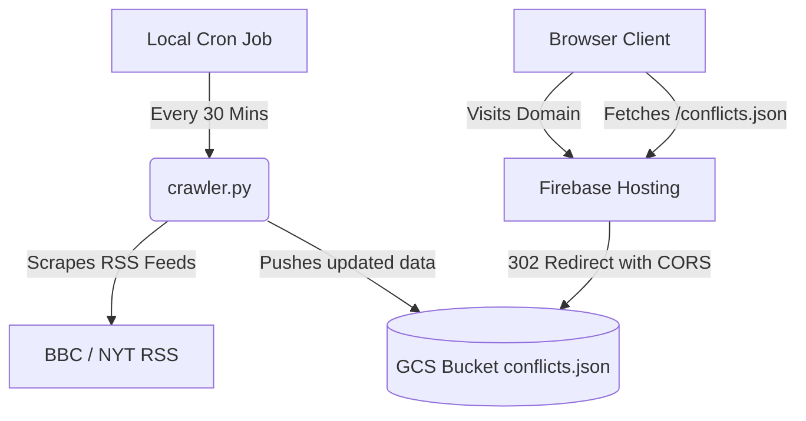

# Global Conflict Tracker

An interactive geopolitical intelligence dashboard that monitors active global conflicts, calculates escalatory risk levels, runs scenario spillover simulations, and displays historical correlation analyses.

🌍 **Live Website**: [https://globalconflicttracker2026.org](https://globalconflicttracker2026.org)  
🚀 **Staging Sandbox**: [https://crisis-tracker-2026-291635.web.app](https://crisis-tracker-2026-291635.web.app)

---

## 🛠️ Key Features

### 1. Geopolitical Conflict Heatmap
* Overlaid circles on a dark-themed world map depicting active conflict zones.
* **Circle Color (Spillover Risk)**: Yellow (localized/contained) up to Deep Red (extremely high global spillover).
* **Circle Size (Intensity)**: Visualizes the scale of active military campaigns, civil war, or localized skirmishes.
* Tooltips provide real-time details of key participants, risk indices, and geographic boundaries.

### 2. Escalation Sandbox Simulator
* Simulate complex geopolitical shifts by toggling triggers for selected conflict zones:
  * **Foreign Military Direct Involvement**: Triggers regional containment alarms.
  * **Strait Blockade / Supply Chain Halt**: Spikes transport costs and inflation.
  * **Critical Infrastructure Cyberattacks**: Paralyzes power grid grids and digital operations.
* Simulates updated spillover risk scores and changes marker circles dynamically on the fly.

### 3. Predictive Escalation Charting
* Interactive line charts (powered by Chart.js) showing 12-month projections of conflict escalation based on sandbox configurations.

### 4. Tabbed Geopolitical Analysis Pane
* Deep-dive narratives linking current conflicts to historical patterns:
  * **Historical Parallels**: Pre-1914 Multipolarity vs. 2026, proxy war limits, and historic maritime blockades.
  * **Escalation Predictor**: Real-time Global Tension index and hybrid warfare predictions.
  * **Global Economic Impact**: Short and long-term forecasts detailing energy prices, reserve currency de-dollarization, and the technology chip famine.

---

## 🏗️ Architecture & Serverless Design

The application is engineered to maintain a strict GCP budget ceiling under **$12/year** (the cost of domain registration), keeping all computing serverless and operational costs at **$0.00/month**:



1. **Static CDN Hosting (Firebase Hosting)**: Serves static assets on the custom domain with free, zero-configuration SSL, bypassing base Application Load Balancer costs ($18/month).
2. **Serverless Data Store (Google Cloud Storage)**: The current geopolitical datasets are maintained inside a public GCS bucket (`gs://crisis-tracker-2026-291635`) with CORS support.
3. **Automated Feed Crawler**: A Python script runs in the background locally every 30 minutes to parse news feeds, identify conflict spikes via keyword matrices, generate the updated dataset (`conflicts.json`), and push it directly to GCS.
4. **CORS & Redirects**: Requests for `/conflicts.json` are dynamically routed by Firebase Hosting to GCS. `Cache-Control: no-cache` headers ensure client browsers load fresh datasets immediately without cache issues.

---

## 🔒 Security Specifications
* **Content Security Policy (CSP)**: Locks down frames, scripts, styles, and image sources to approved CDNs.
* **Subresource Integrity (SRI)**: Integrates cryptographic hashes on CDN imports (Leaflet & Chart.js) to block cross-site script injection.
* **Identity Isolation**: Cloud actions use a restricted service account credential key isolated from global owner logins.

---

## 🚀 Local Development Setup

### Prerequisites
* Node.js (v18+)
* Python 3

### Running the Web Dashboard
1. Clone the repository.
2. Run `npm start` to spin up a local development server at `http://localhost:5000`.

### Running the Crawler Manually
1. Set up your Google Application Credentials.
2. Run the crawler script:
   ```bash
   python3 crawler.py
   ```

---

## 📄 License
This project is licensed under the MIT License - see the [LICENSE](LICENSE) file for details.
